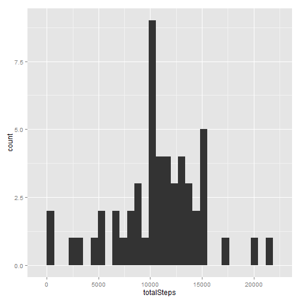
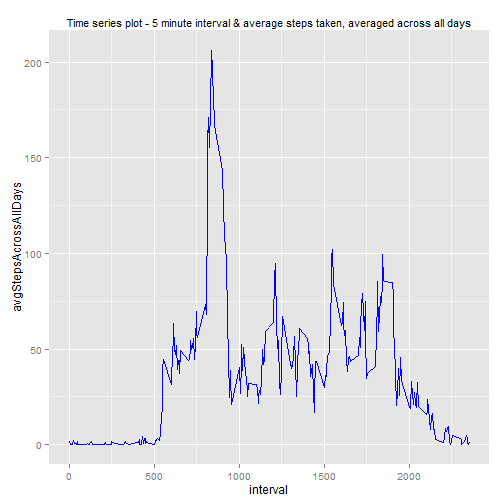
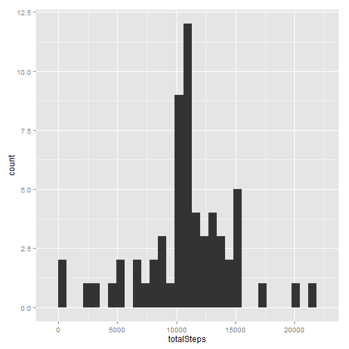
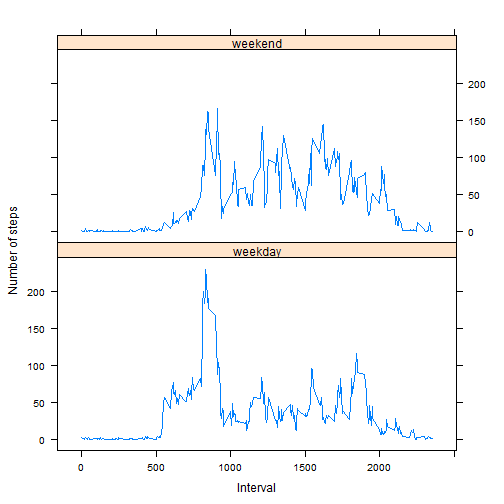

# Reproducible Research: Peer Assessment 1

This is the  submission **Reproduceable research course** Peer Assessment 1 submission.  

## Loading and preprocessing the data
In the following section, we implement the steps to download the data file and load the data.  
1. Download the data file from the URL mentioned.  
2. Unzip the donwloaded file.  
2. Load the data using read.csv into variable called **data**  


```r
library(plyr)
library(ggplot2)
library(lattice)

#Check and create a data folder
if(!file.exists("data")){dir.create("data")}

# Download the file
fileUrl= "http://d396qusza40orc.cloudfront.net/repdata%2Fdata%2Factivity.zip"
download.file(fileUrl,"activity.zip")

#read the data file
unzip("activity.zip")
data = read.csv("activity.csv", header=TRUE,  na.strings = "NA", stringsAsFactors = FALSE)
```


## What is mean total number of steps taken per day?

For this part of the assignment, we ignore the missing values in the dataset.  

1. Make a histogram of the total number of steps taken each day.
2. Calculate and report the mean and median total number of steps taken per day.

**The steps are as follows**   
a. Use **ddply** to summarize the total number of steps based on date.  
b. Use **ggplot** to draw the histogram of total number of steps taken each day.
c. Calculate and print the mean and median total number of steps taken per day.


```r
#convert date column from character to Date class
data$date<-as.Date(data$date)

#split the number of steps by date
stepsSummaryData<-ddply(data,"date",summarize, totalSteps = sum(steps))

#draw the histogram of number of total steps per day
g <- ggplot(stepsSummaryData, aes(totalSteps))
g<-g+geom_histogram()
print(g)
```

```
## stat_bin: binwidth defaulted to range/30. Use 'binwidth = x' to adjust this.
```

 

```r
#calculate the mean and median of steps per day, ignore the NA values
meanTotalStepsPerDay<-mean(stepsSummaryData$totalSteps,na.rm=TRUE)
medianTotalStepsPerDay<-median(stepsSummaryData$totalSteps,na.rm=TRUE)
```

The *mean of total number of steps* taken per day is **1.0766 &times; 10<sup>4</sup>**.  
The *median of total number of steps* taken per day is **10765**.    


## What is the average daily activity pattern?

For this part of the assignment, we need to answer the following questions.
1. Make a time series plot (i.e. type = "l") of the 5-minute interval (x-axis) and the average number of steps taken, averaged across all days (y-axis)  

2. Which 5-minute interval, on average across all the days in the dataset, contains the maximum number of steps?   


**The steps are as follows**    
a. Split the data based on the intervals using **split** function.  
b. Iterate through data for each interval and summarize the average steps for each interval across all days.  
c. Use **ggplot** to create time series graph of 5 minutes intervals and average steps across all days. 


```r
#split the data set based on the 5 minute intervals for all the days
dataByIntervals <- split(data, data$interval)

#get the list of the list dataByIntervals
listLength<-length(dataByIntervals)

#data frame to store the steps per interval
intervalStepsData<-data.frame()

for (i in seq(from=1, to=listLength, by=1))
{
        # The first column steps. Calculate the average across all days
        # in current interval
        stepsTmp<-mean(dataByIntervals[[i]][[1]], na.rm=TRUE)
        #The third column is the interval data point
        intervalTmp<-unique(dataByIntervals[[i]][[3]])
        #add this row to summary information per interval
        intervalStepsData<-rbind(intervalStepsData,c(intervalTmp,stepsTmp))
}

#rename the columns to interval_identifier and avgStepsAcross all days
colnames(intervalStepsData)<-c("interval","avgStepsAcrossAllDays")

#round the average steps across all days so that it is more readable and easy to plot
intervalStepsData$avgStepsAacrossAllDays<-round(intervalStepsData$avgStepsAcrossAllDays, digits=1)

# Make a time series plot (i.e. type = "l") of the 5-minute interval (x-axis) and 
# the average number of steps taken, averaged across all days (y-axis)
# Use ggplot to plot the time series data
g <- ggplot(intervalStepsData, aes(interval, avgStepsAcrossAllDays))
g<-g+geom_line(aes(interval, avgStepsAcrossAllDays), color = "blue")+
        labs(title = "Time series plot - 5 minute interval & average steps taken, averaged across all days")+
        theme(plot.title = element_text(size = rel(0.95)))
print(g)
```

 

```r
# Which 5-minute interval, on average across all the days in the dataset, 
# contains the maximum number of steps?

#get the row containing the maximum value for average number of steps in across all days
rowId <- which.max(intervalStepsData$avgStepsAcrossAllDays)
#get the interval corresponding to the maximum value of average steps across all days
interval_With_Max_Avg_Steps<-intervalStepsData[rowId,1]
```

The *5 minute minute interval that has maximum number of steps* (averaged across all days) is **835**.  


## Imputing missing values  

Note that there are a number of days/intervals where there are missing values (coded as NA). The presence of missing days may introduce bias into some calculations or summaries of the data.

1. Calculate and report the total number of missing values in the dataset (i.e. the total number of rows with NAs).  

2. Devise a strategy for filling in all of the missing values in the dataset. The strategy does not need to be sophisticated. For example, you could use the mean/median for that day, or the mean for that 5-minute interval, etc.  

3. Create a new dataset that is equal to the original dataset but with the missing data filled in.  

4. Make a histogram of the total number of steps taken each day and Calculate and report the mean and median total number of steps taken per day. Do these values differ from the estimates from the first part of the assignment? What is the impact of imputing missing data on the estimates of the total daily number of steps?  


**The steps are as follows**    
a. Calculate and print the number of NA in *steps*.
b. Iterate through the unique list of intervals.  
c. For each interval, calculate the mean across all days. So, in this case, we are using the **mean** of the values as the replacement for **NA** values.   
d. For each interval, replace the NA values with the mean calculated in step 2.  
e. Summarize the data using **ddply** to get the total number of steps across each day.
f. Use **ggplot** to draw the histogram with the new data set.


```r
# Imputing missing values
# Calculate and report the total number of missing values in the dataset (i.e. the total number of rows with NAs)
steps_NA_data<-data[is.na(data$steps),]

#report the number of missing values
number_NA<-nrow(steps_NA_data)

#get the unique values for each 5 minute intervals
intervals<-unique(data$interval)

#iterate through the subset of each interval and replace NA with the mean of steps for each interval
for (i in intervals)
{
        #get the mean number of steps for the given interval
        #steps is stored in the first column data set
        stepsTmp<-mean(data[data$interval == i,1], na.rm =TRUE)
        #get the rows with NA values for the current interval and replace with mean value
        #stored in stepsTmp
        #steps is in the first column of the data set
        data[(data$interval == i & is.na(data$steps)),1]<-stepsTmp
}

#split the number of steps by date
newStepsSummaryData<-ddply(data,"date",summarize, totalSteps = sum(steps))

#Now make a histogram of the total number of steps taken each day and Calculate 
g <- ggplot(newStepsSummaryData, aes(totalSteps))
g<-g+geom_histogram()
print(g)
```

```
## stat_bin: binwidth defaulted to range/30. Use 'binwidth = x' to adjust this.
```

 

```r
#Report the mean and median total number of steps taken per day
newMeanSteps<-mean(newStepsSummaryData$totalSteps)
newMedianSteps<-median(newStepsSummaryData$totalSteps)
```

The *total number of missing values in the data set* is **2304**.   

The **new** *mean of total number of steps* taken per day is **1.0766 &times; 10<sup>4</sup>**.    
The **new** *median of total number of steps* taken per day is **1.0766 &times; 10<sup>4</sup>**.     

The mean remains the same as the first part of the assignment as we are using **mean** to replace NA values.  
The median increases by a small amount, compared to the first part, as the NAs have been replaced with mean values. The mean values used are non-negative/large and hence increases the median by small amount.

## Are there differences in activity patterns between weekdays and weekends?


1. Create a new factor variable in the dataset with two levels - "weekday" and "weekend" indicating whether a given date is a weekday or weekend day.  

2. Make a panel plot containing a time series plot (i.e. type = "l") of the 5-minute interval (x-axis) and the average number of steps taken, averaged across all weekday days or weekend days (y-axis).  


**The steps are as follows**    
a. Create a new column called **weekday** to get the weekday corresponding to the date of the measurement.  
b. Create another column **isWeekday** to classify the day as *weekend* or *weekday*.   
c. Convert *isWeekday* into a factor variable.  
d. Use **split** function to split the data by cominations of weekday and interval.
e. Create summary data for average steps across all intervals along with weekend/weekday classification.  
f. Use **lattice** plotting system to create panel plot time series plot of 5 minute interval and the average number of steps taken, averaged across all weekday or weekend days.  


```r
#Are there differences in activity patterns between weekdays and weekends?
#Add a new column to get the weekday corresponding to the date
data$weekday<-weekdays(data$date)

#add column variable to identify Monday, Tuesday, Wednesday, Thursday, Friday as weekday
data[(data$weekday == "Monday" | 
             data$weekday == "Tuesday"|
             data$weekday == "Wednesday"|
             data$weekday == "Thursday"| 
              data$weekday == "Friday"),"isWeekday"]<-"weekday"

#add column variable to identify Saturday, Sunday,as weekend
data[(data$weekday == "Saturday" | 
              data$weekday == "Sunday")
              ,"isWeekday"]<-"weekend"

#Convert isWeekday into a factor variable
data$isWeekday<-as.factor(data$isWeekday)
levels(data$isWeekday)<-c("weekday","weekend")

#split the data based on intervals and weekdays
dataByIntervalsWeekdays <- split(data, paste(data$interval,data$isWeekday))

#iterate through the all combinations of weekday and intervals to calculate the 
#avergage number of steps taken per weekeday or weekend

listLength<-length(dataByIntervalsWeekdays)
intervalStepsWeekdayData<-data.frame()

for (i in seq(from=1, to=listLength, by=1))
{
        # The fifth column is the identifier if its a weekday or not
        isWeekdayTmp<-unique(dataByIntervalsWeekdays[[i]][[5]])
        #The third column is the interval data point
        intervalTmp<-unique(dataByIntervalsWeekdays[[i]][[3]])
        #get the average number of steps taken for each weekday, weekend combination
        #First column contains the number of steps
        averageStepsTmp<-mean(dataByIntervalsWeekdays[[i]][[1]])
                
        #add this row to summary information per interval
        intervalStepsWeekdayData<-rbind(intervalStepsWeekdayData,c(intervalTmp,isWeekdayTmp,averageStepsTmp))
}

colnames(intervalStepsWeekdayData)<-c("Interval","isWeekday","Number_of_steps")
#round the Number_of_steps variable to one decimal for ease of plotting and reading
intervalStepsWeekdayData$Number_of_steps<-round(intervalStepsWeekdayData$Number_of_steps, digits = 1)

#order the data based on intervals
intervalStepsWeekdayData<-intervalStepsWeekdayData[order(intervalStepsWeekdayData$Interval),]

#Change isWeekday into a factor variable
intervalStepsWeekdayData$isWeekday<-as.factor(intervalStepsWeekdayData$isWeekday)
levels(intervalStepsWeekdayData$isWeekday) <- c("weekday","weekend")

#create a lattice plot for the weekday 
xyplot(Number_of_steps ~ Interval | isWeekday , data = intervalStepsWeekdayData, type = "l", layout = c(1,2),
       xlab = "Interval", ylab = "Number of steps")
```

 


Yes, there is *significant* difference in the activity pattern between weekdays and weekends. In the weekends, the average number of steps (across all days) seems to be *uniform* across all 5 minutes intervals. In the weekdays, the average number of steps (across all days) seems to be *higher* in the *lower 5 minute intervals* compared to the *higher 5 minute intervals*.
